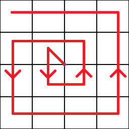

> [!NOTE]
> To run these scripts you'll need the [Minescript mod](https://minescript.net/)
> All the scripts have to be placed in the `\minecraft\minescript` folder

> [!WARNING]
> Not all scripts are optimized yet

## [Discover V1](discoverWorldV1.py)
> [!NOTE]  
> - You have to have Op rights to use this script since it relies on `/tp`
>- The config variable still have to be set in the file. V2 will fix this

This program uses teleports to discover the world. It can be useful for WorldMap or Distant Horizons/Voxy.

---
## [Babysit Sweepers V2](babysitSweeperV2.py)
>[!NOTE]
> - This script requires the [Carpet mod](https://modrinth.com/mod/carpet) and it's [/player](https://github.com/gnembon/fabric-carpet/wiki/Commands#player) command
> - WorldEater start coordinates have to be set in the file config.

>[!warning]
> This script only has a basic error handling!

This script will spawn bots along the length of the WorldEater. This is good in case a sweeper is stuck and you don't want to babysit it. Especially useful for big Worldeaters/Perimeters.

How to use:
If your WorldEater is heading North-South enter the most South coordinate.
If it's heading East-West then enter themost East coordinate.
Enter renderDistance, Worldeater length and bot spawn height.

1. unstuck the sweeper
2. look into the direction where the sweeper is going to head
3. start the bot spawning script by typing `\babysitSweeperV2 <name>`
4. start the Sweeper
5. once the sweeper is docked, kill all the bots by using the [\kill](/README.md#kill-bots) script.

---
## Misc
Utility scripts

### [Get player rotation](getPlayerRotation.py)
This script simply outputs the players rotation

Usage: `\getPlayerRotation`

### [Kill bots](killBots.py)
This will kill all bots that match the given arguments

Usage: `\killBots <name> <amount>`

Example: `\killBots x 4`

---
# Todo
- [ ] Optimize [Babysit](./babysitSweeperV2.py)
- [ ] Do [discoverWorld](./discoverWorldV1.py) V2

